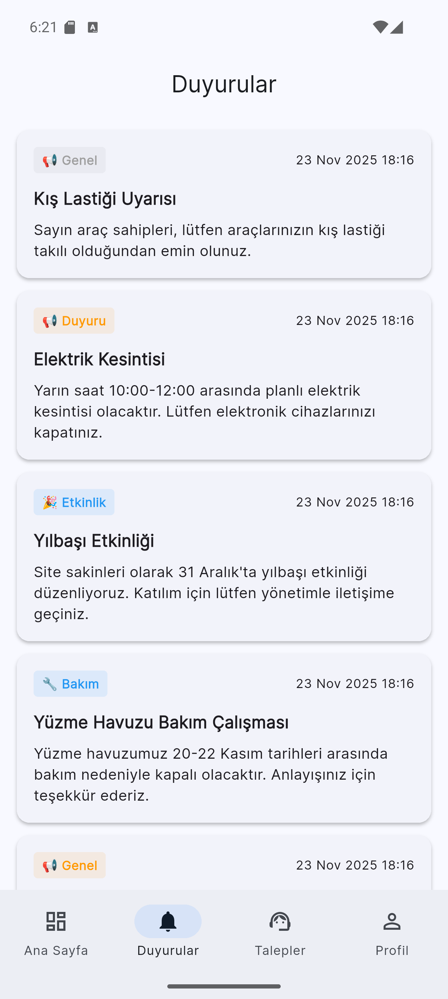
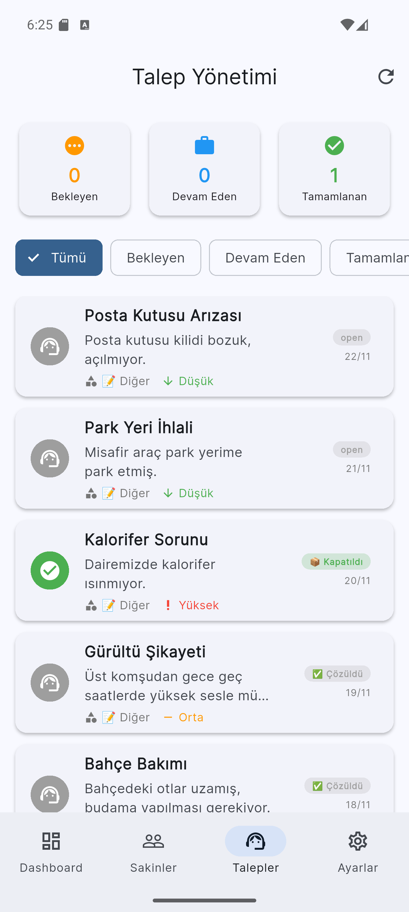
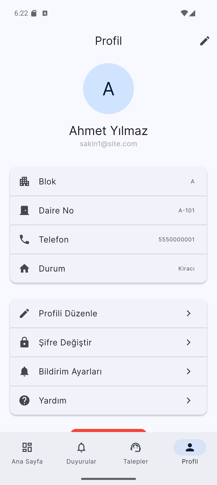
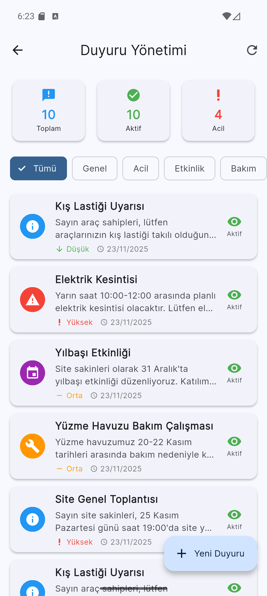
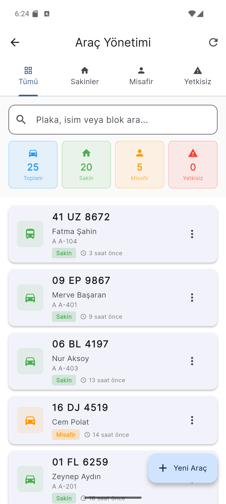
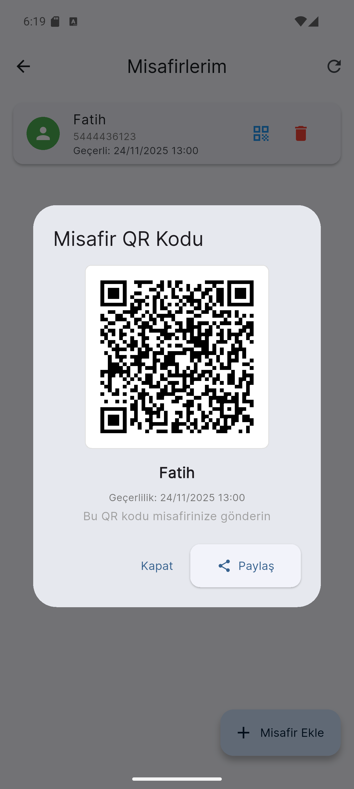

<p align="center">
  <a href="#-english">🇬🇧 English</a> | <a href="#-türkçe">🇹🇷 Türkçe</a>
</p>

---

# 🇹🇷 Türkçe

<p align="center">
  
</p>

## 🏢 Çardak - Akıllı Yaşam Yönetim Platformu

Çardak, site yaşamını dijitalleştiren kapsamlı bir yönetim platformudur. Mobil uygulama ile sakinler aidat ödemelerini takip eder, ortak alanları (spor salonu, havuz) rezerve eder, bakım taleplerinde bulunur ve site içi pazaryerinde alışveriş yapar. Yöneticiler ise web panelinden tüm siteyi kontrol eder, duyuru gönderir, araç giriş-çıkışlarını takip eder ve AI destekli analizlerle kararlar alır. Yapay zeka chatbot sakinlerin sorularını anında yanıtlar. Plaka tanıma sistemi ile güvenlik otomatikleşir. Her şey tek platformda!

**📦 Bu repo sadece backend API ve mobil APK dosyasını içerir. Admin paneli ve mobil kaynak kodu GitHub'a yüklenmemiştir.**

---

## ✨ Özellikler

### 👥 Sakin Özellikleri (Mobil App)

- 💰 **Aidat Yönetimi**: Ödeme geçmişi ve bekleyen ödemeler



- 📢 **Duyurular**: Anlık site duyurularını takip
- 🎯 **Rezervasyonlar**: Ortak alanları rezerve etme (spor salonu, havuz, toplantı salonu)


- 🛠️ **Talep & Arıza**: Bakım talepleri ve arıza bildirimleri



- 🛒 **Pazaryeri**: Site içi alışveriş platformu
- 🗳️ **Anketler**: Topluluk kararlarına katılım


- 🤖 **AI Asistan**: LM Studio entegrasyonu ile akıllı chatbot
- 📊 **AI Analytics**: Yapay zeka destekli kullanım analizi



### 🔧 Yönetici Özellikleri

- 👨‍👩‍👧‍👦 **Sakin Yönetimi**: Kullanıcı ekleme, düzenleme, raporlama
- 💳 **Ödeme Takibi**: Aidat toplama ve raporlama


- 📝 **Duyuru Yönetimi**: Toplu bildirim gönderme



- 🎫 **Talep Yönetimi**: İş emirleri ve görev atama


- 🚗 **Araç Yönetimi**: Plaka tanıma (LPR) simülasyonu
- 📊 **Dashboard**: Detaylı istatistik ve raporlar


### 🚗 Akıllı Plaka Tanıma (LPR)

- Araç giriş/çıkış takibi
- Sakin, misafir ve yetkisiz araç kategorileri




- Otopark doluluk analizi
- Güven skoru ile tanıma kalitesi
- Gerçek zamanlı simülasyon



---

## 🛠️ Teknoloji Stack

### Backend (Node.js)
```
- Express.js - RESTful API
- SQLite - Hafif veritabanı
- Sequelize ORM - Veri modelleme
- JWT - Kimlik doğrulama
- Gemini AI - Bulut AI servisi (yedek)
- LM Studio - Yerel AI model entegrasyonu
- Bcrypt - Şifre hashlama
```

### Mobil (Flutter)
```
- Flutter - Çapraz platform framework
- Provider - Durum yönetimi
- Hive - Yerel NoSQL veritabanı
- HTTP - API iletişimi
- SharedPreferences - Kullanıcı ayarları
```

---

## 📦 Kurulum

### ✅ Gereksinimler

- **Node.js** v16+ ve npm
- **LM Studio** (AI özelliği için)
- **Git**

### 1️⃣ Backend Kurulumu

```bash
# Projeyi klonlayın
git clone https://github.com/your-username/emkon-hackathon.git
cd emkon-hackathon/cardak-backend

# Bağımlılıkları yükleyin
npm install

# Ortam değişkenlerini ayarlayın
cp .env.example .env

# Geliştirme modunda başlatın
npm run dev
```

Backend `http://localhost:5000` adresinde çalışacak

**✨ İlk Çalıştırmada Otomatik Oluşturulur:**
- ✅ SQLite veritabanı
- ✅ 50 örnek kullanıcı (48 sakin + 2 admin)
- ✅ 28 araç kaydı (20 sakin + 5 misafir + 3 yetkisiz)
- ✅ Örnek duyurular, anketler, ödemeler

### 2️⃣ LM Studio Kurulumu (AI Özelliği İçin)

LM Studio, yerel bilgisayarınızda AI modelleri çalıştırmanızı sağlar.

#### Adım 1: LM Studio İndirme

1. [LM Studio](https://lmstudio.ai/) web sitesini ziyaret edin
2. İşletim sisteminize uygun sürümü indirin
   - Windows: `LM-Studio-Setup.exe`
   - macOS: `LM-Studio.dmg`
   - Linux: `LM-Studio.AppImage`

#### Adım 2: Model İndirme

1. LM Studio'yu açın
2. **"Discover"** sekmesine gidin
3. Önerilen modeller:
   - **Gemma 2B** (Hızlı, düşük kaynak)
   - **Phi-3 Mini** (Dengeli performans)
   - **Llama 3.2 3B** (Daha iyi kalite)
4. Model dosyasını indirin (3-10 GB)

#### Adım 3: Local Server Başlatma

1. LM Studio'da **"Local Server"** sekmesine gidin
2. İndirdiğiniz modeli seçin
3. **"Start Server"** butonuna tıklayın
4. Sunucu `http://localhost:1234` adresinde başlayacak

#### Adım 4: Backend ile Entegrasyon

Backend `.env` dosyanızda:

```env
# LM Studio Konfigürasyonu
LM_STUDIO_URL=http://localhost:1234/v1
LM_STUDIO_MODEL=gemma-2b-it  # İndirdiğiniz modelin adı

# Gemini AI (Yedek)
GEMINI_API_KEY=your-gemini-api-key  # Opsiyonel
```

**AI Özelliği Nasıl Çalışır?**

1. **Öncelik**: LM Studio (Yerel)
2. **Yedek**: Gemini AI (Bulut)
3. Eğer LM Studio çalışmıyorsa Gemini'ye geçer

**LM Studio Avantajları:**
- ✅ Tamamen ücretsiz
- ✅ İnternet gerektirmez
- ✅ Veri gizliliği
- ✅ Hızlı yanıt süreleri

### 3️⃣ Mobil Uygulama (APK)

**APK Dosyasını İndirin:**

1. [Releases](https://github.com/your-username/emkon-hackathon/releases) sayfasından en son APK'yı indirin
2. Android telefonunuza yükleyin
3. "Bilinmeyen Kaynaklardan Yükleme" izni verin

**İlk Açılış Ayarı:**

1. Uygulama IP adresi soracak
2. Backend sunucunuzun IP adresini girin
   - **Aynı Wi-Fi ağında**: `192.168.1.XXX`
   - **Farklı ağdan**: Public IP gerekir
3. "Devam Et"

**IP Adresinizi Bulma:**

```powershell
# Windows
ipconfig | Select-String "IPv4"

# Mac/Linux
ifconfig | grep "inet "
hostname -I
```

**Login Bilgileri:**
- Admin: `admin@admin.com` / `admin123`
- Sakin: `ayse.yilmaz@email.com` / `password123`

---

## 🔐 Varsayılan Kullanıcılar

| Rol | Email | Şifre |
|-----|-------|-------|
| Admin | `admin@admin.com` | `admin123` |
| Manager | `manager@manager.com` | `manager123` |
| Güvenlik | `ahmet@cardak.com` | `password123` |
| Sakin | `ayse.yilmaz@email.com` | `password123` |

---

## 📂 Proje Yapısı

```
emkon-hackathon/
├── 🔧 cardak-backend/        # Node.js Backend API
│   ├── src/
│   │   ├── models/           # Sequelize modelleri
│   │   ├── routes/           # API route'ları
│   │   ├── services/         # İş mantığı
│   │   ├── middleware/       # Auth, validation vb.
│   │   └── server.js         # Ana sunucu
│   └── package.json
│
├── 📱 Çardak.apk             # Android Mobil Uygulama
│
└── 📚 docs/                  # Dokümantasyon
```

**Not:** Admin paneli ve mobil kaynak kodu bu repo'da bulunmamaktadır.

---

## 🚀 Özellik Detayları

### Raporlar ve İstatistikler


- Detaylı kullanım raporları
- Trend analizi
- İstatistik görselleri

### Yönetici İşlemleri


- Kolay yönetim arayüzü
- Hızlı işlem gerçekleştirme

### Güvenlik ve Kontrol


- Güvenlik izleme
- Erişim kontrolü

---

## 🔄 API Endpoints

### Kimlik Doğrulama
```
POST /api/v1/auth/login
POST /api/v1/auth/register
GET  /api/v1/auth/me
```

### Ödemeler
```
GET  /api/v1/payments
GET  /api/v1/payments/user/:userId
POST /api/v1/payments
```

### Araçlar
```
GET    /api/v1/vehicles
POST   /api/v1/vehicles
DELETE /api/v1/vehicles/:id
GET    /api/v1/vehicles/stats/overview
```

### LPR
```
POST /api/v1/lpr/simulate
POST /api/v1/lpr/simulate-batch
GET  /api/v1/lpr/parking-analysis
```

---

## 🤝 Katkıda Bulunma

1. Fork edin
2. Feature branch oluşturun (`git checkout -b feature/amazing-feature`)
3. Commit edin (`git commit -m 'Add amazing feature'`)
4. Push edin (`git push origin feature/amazing-feature`)
5. Pull Request açın

---

## 📝 Lisans

Bu proje MIT lisansı altında lisanslanmıştır.

---

## 👥 Ekip

Emkon Hackathon 2025

---

## 📞 İletişim

Proje ile ilgili sorularınız için issue açabilirsiniz.

⭐ Projeyi beğendiyseniz yıldız vermeyi unutmayın!

---

---

# 🇬🇧 English

<p align="center">
  
</p>

## 🏢 Çardak - Smart Community Management Platform

Çardak is a comprehensive platform that digitizes residential complex life. Through the mobile app, residents track dues payments, reserve common areas (gym, pool), submit maintenance requests, and shop in the internal marketplace. Administrators control everything from the web panel, send announcements, monitor vehicle entry-exit, and make decisions with AI-powered analytics. An AI chatbot instantly answers residents' questions. Security is automated with license plate recognition. Everything in one platform!

**📦 This repository contains only the backend API and mobile APK file. The admin panel and mobile source code are not uploaded to GitHub.**

---

## ✨ Features

### 👥 Resident Features (Mobile App)

- 💰 **Payment Management**: Payment history and pending dues


- 📢 **Announcements**: Real-time site announcements
- 🎯 **Reservations**: Book common areas (gym, pool, meeting rooms)


- 🛠️ **Requests & Complaints**: Maintenance requests and issue reporting


- 🛒 **Marketplace**: Internal community marketplace
- 🗳️ **Polls**: Participate in community decisions


- 🤖 **AI Assistant**: Smart chatbot with LM Studio integration
- 📊 **AI Analytics**: AI-powered usage analytics


### 🔧 Admin Features

- 👨‍👩‍👧‍👦 **Resident Management**: Add, edit, and report users
- 💳 **Payment Tracking**: Dues collection and reporting


- 📝 **Announcement Management**: Send bulk notifications


- 🎫 **Request Management**: Work orders and task assignment


- 🚗 **Vehicle Management**: License Plate Recognition simulation
- 📊 **Dashboard**: Detailed statistics and reports


### 🚗 Smart License Plate Recognition (LPR)

- Vehicle entry/exit tracking
- Resident, guest, and unauthorized vehicle categories


- Parking occupancy analysis
- Recognition quality with confidence score
- Real-time simulation


---

## 🛠️ Technology Stack

### Backend (Node.js)
```
- Express.js - RESTful API
- SQLite - Lightweight database
- Sequelize ORM - Data modeling
- JWT - Authentication
- Gemini AI - Cloud AI service (fallback)
- LM Studio - Local AI model integration
- Bcrypt - Password hashing
```

### Mobile (Flutter)
```
- Flutter - Cross-platform framework
- Provider - State management
- Hive - Local NoSQL database
- HTTP - API communication
- SharedPreferences - User settings
```

---

## 📦 Installation

### ✅ Requirements

- **Node.js** v16+ and npm
- **LM Studio** (for AI features)
- **Git**

### 1️⃣ Backend Setup

```bash
# Clone the repository
git clone https://github.com/your-username/emkon-hackathon.git
cd emkon-hackathon/cardak-backend

# Install dependencies
npm install

# Setup environment variables
cp .env.example .env

# Start in development mode
npm run dev
```

Backend will run at `http://localhost:5000`

**✨ Auto-created on First Run:**
- ✅ SQLite database
- ✅ 50 sample users (48 residents + 2 admins)
- ✅ 28 vehicles (20 resident + 5 guest + 3 unauthorized)
- ✅ Sample announcements, polls, payments

### 2️⃣ LM Studio Setup (For AI Features)

LM Studio allows you to run AI models locally on your computer.

#### Step 1: Download LM Studio

1. Visit the [LM Studio](https://lmstudio.ai/) website
2. Download for your OS
   - Windows: `LM-Studio-Setup.exe`
   - macOS: `LM-Studio.dmg`
   - Linux: `LM-Studio.AppImage`

#### Step 2: Download a Model

1. Open LM Studio
2. Go to the **"Discover"** tab
3. Recommended models:
   - **Gemma 2B** (Fast, low resource)
   - **Phi-3 Mini** (Balanced performance)
   - **Llama 3.2 3B** (Better quality)
4. Download the model file (3-10 GB)

#### Step 3: Start Local Server

1. Go to the **"Local Server"** tab in LM Studio
2. Select your downloaded model
3. Click the **"Start Server"** button
4. Server will start at `http://localhost:1234`

#### Step 4: Integration with Backend

In your backend `.env` file:

```env
# LM Studio Configuration
LM_STUDIO_URL=http://localhost:1234/v1
LM_STUDIO_MODEL=gemma-2b-it  # Your downloaded model name

# Gemini AI (Fallback)
GEMINI_API_KEY=your-gemini-api-key  # Optional
```

**How Does AI Work?**

1. **Priority**: LM Studio (Local)
2. **Fallback**: Gemini AI (Cloud)
3. Falls back to Gemini if LM Studio is unavailable

**LM Studio Advantages:**
- ✅ Completely free
- ✅ No internet required
- ✅ Data privacy
- ✅ Fast response times

### 3️⃣ Mobile App (APK)

**Download the APK File:**

1. Download the latest APK from the [Releases](https://github.com/your-username/emkon-hackathon/releases) page
2. Install on your Android phone
3. Allow "Install from Unknown Sources"

**First Launch Setup:**

1. App will ask for IP address
2. Enter your backend server IP address
   - **Same Wi-Fi network**: `192.168.1.XXX`
   - **Different network**: Public IP required
3. "Continue"

**Finding Your IP Address:**

```powershell
# Windows
ipconfig | Select-String "IPv4"

# Mac/Linux
ifconfig | grep "inet "
hostname -I
```

**Login Credentials:**
- Admin: `admin@admin.com` / `admin123`
- Resident: `ayse.yilmaz@email.com` / `password123`

---

## 🔐 Default Users

| Role | Email | Password |
|------|-------|----------|
| Admin | `admin@admin.com` | `admin123` |
| Manager | `manager@manager.com` | `manager123` |
| Security | `ahmet@cardak.com` | `password123` |
| Resident | `ayse.yilmaz@email.com` | `password123` |

---

## 📂 Project Structure

```
emkon-hackathon/
├── 🔧 cardak-backend/        # Node.js Backend API
│   ├── src/
│   │   ├── models/           # Sequelize models
│   │   ├── routes/           # API routes
│   │   ├── services/         # Business logic
│   │   ├── middleware/       # Auth, validation etc.
│   │   └── server.js         # Main server
│   └── package.json
│
├── 📱 Çardak.apk             # Android Mobile Application
│
└── 📚 docs/                  # Documentation
```

**Note:** Admin panel and mobile source code are not included in this repository.

---

## 🚀 Feature Details

### Reports and Statistics


- Detailed usage reports
- Trend analysis
- Statistical visualizations

### Admin Operations


- User-friendly interface
- Quick operations

### Security and Control


- Security monitoring
- Access control

---

## 🔄 API Endpoints

### Authentication
```
POST /api/v1/auth/login
POST /api/v1/auth/register
GET  /api/v1/auth/me
```

### Payments
```
GET  /api/v1/payments
GET  /api/v1/payments/user/:userId
POST /api/v1/payments
```

### Vehicles
```
GET    /api/v1/vehicles
POST   /api/v1/vehicles
DELETE /api/v1/vehicles/:id
GET    /api/v1/vehicles/stats/overview
```

### LPR
```
POST /api/v1/lpr/simulate
POST /api/v1/lpr/simulate-batch
GET  /api/v1/lpr/parking-analysis
```

---

## 🤝 Contributing

1. Fork the repository
2. Create your feature branch (`git checkout -b feature/amazing-feature`)
3. Commit your changes (`git commit -m 'Add amazing feature'`)
4. Push to the branch (`git push origin feature/amazing-feature`)
5. Open a Pull Request

---

## 📝 License

This project is licensed under the MIT License.

---

## 👥 Team

Emkon Hackathon 2025

---

## 📞 Contact

Feel free to open an issue for any questions about the project.

⭐ Don't forget to star this project if you like it!